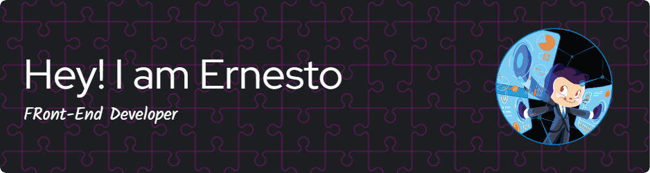

<h1 align="center">Hi 👋, I'm Ernesto Osorio</h1>
<h3 align="center">An enthusiastic frontend developer from Norway</h3>

  

- 🔭 I’m currently looking for **my first Job as a Developer**

- 🌱 I’m honing my skills in **HTML, CSS, JavaScript, React JS, TailwindCSS, Bootstrap, PHP, MySQL, WordPress**

- 👨‍💻 All of my projects are available at [https://github.com/nyolarraklay](https://github.com/nyolarraklay)

- 💬 Ask me about **HTML, CSS, JavaScript, ReactJS**

- 📫 How to reach me **ernestojrosorio15@gmail.com**

- ⚡ Fun fact **I dedicated my entire career to nursing in the Philippines. However, when the opportunity arose to further my education, I embraced it and decided to pursue a new path as a developer.**

## Contact Me

## Skills:

## GitHub Stats

